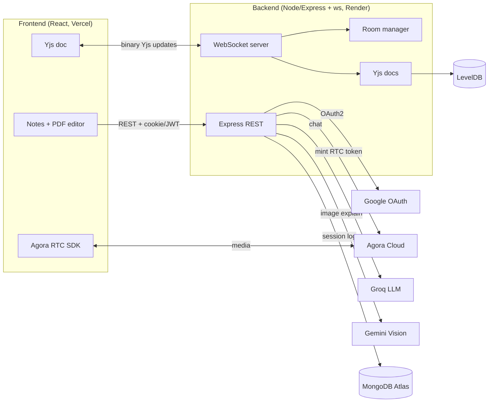
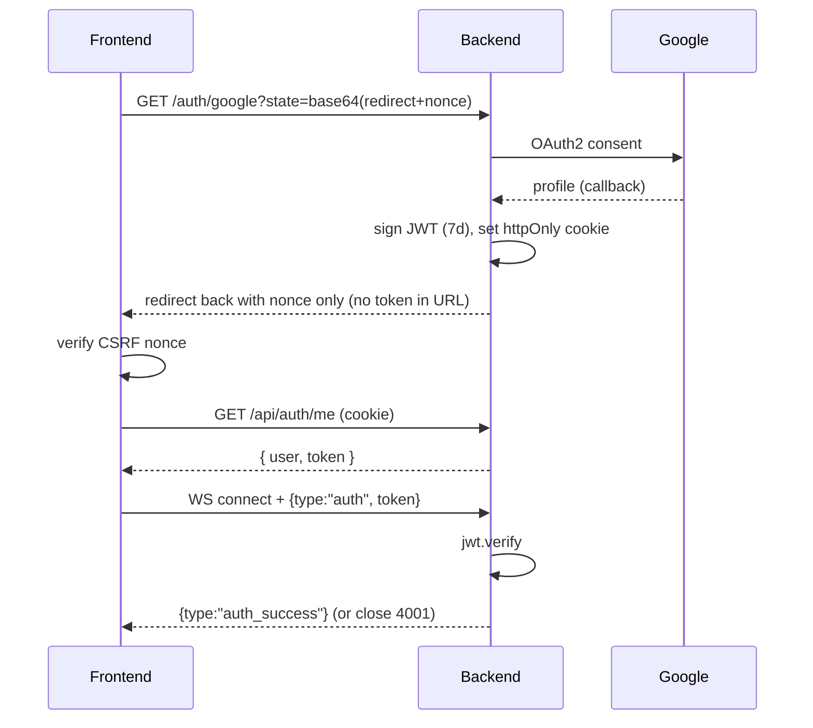
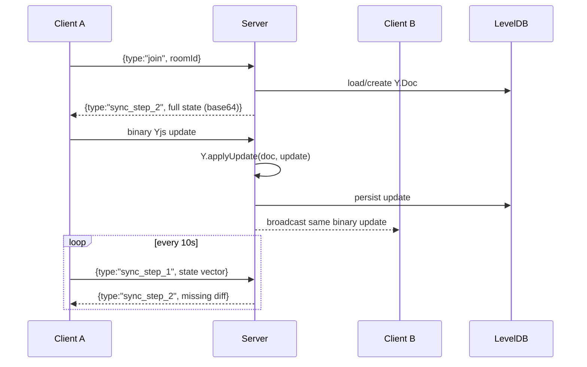

# Architecture — Vani Backend

The realtime server behind Vani/Chanakya: a collaborative PDF/notes editor with
live multi-user editing, audio/video, and an AI assistant. This document explains
how the pieces fit together and the non-obvious design decisions.

## System context

**One WebSocket, two payload kinds.** The server multiplexes everything over a
single WS endpoint: **binary** frames are Yjs CRDT updates; **JSON** frames are
control/signaling messages (`join`, `sync_step_1`, `assign_owner`, `message`,
`webrtc:*`). Media itself never flows through our server — Agora handles that;
we only forward lightweight "ring" invitations.

## Authentication

Google OAuth issues a stateless JWT that authorizes both REST calls and the
WebSocket. The JWT is delivered via an httpOnly cookie (never in the URL), and
the frontend exchanges that cookie for the token it needs to open the socket.

- **CSRF defense:** a nonce is generated client-side, stashed in `sessionStorage`,
  round-tripped through OAuth `state`, and checked on return.
- **`authenticateToken`** (src/auth/middleware.ts) guards REST routes, accepting
  the token from the `Authorization` header or the cookie. The AI routes are
  behind it so the paid LLM endpoints can't be hit anonymously.
- **WS auth handshake:** the socket must send a valid `auth` message before any
  other frame; an invalid/expired token closes with code **4001**, which the
  client treats as "session expired → clear token → login" (no reconnect loop).
- **Fail-fast:** in production the server exits on boot if `JWT_SECRET` /
  `GOOGLE_CLIENT_ID` / `GOOGLE_CLIENT_SECRET` are missing, rather than running on
  insecure defaults.

## Realtime collaboration (Yjs CRDT)

Documents are Yjs CRDTs, so concurrent edits merge without conflicts. The server
is the sync hub and the durable store.

- **On join**, the server sends the *entire* current document state so a late
  joiner is immediately consistent.
- **Live edits** arrive as binary updates: the server applies them to its
  in-memory doc (which persists to LevelDB via a `doc.on("update")` hook) and
  rebroadcasts the raw bytes to the other clients. Persistence and broadcast are
  deliberately separated so updates aren't sent twice.
- **Periodic `sync_step_1`** carries a state vector; the server replies with only
  the updates the client is missing — a cheap anti-entropy safety net against
  dropped frames.

### Rooms & roles (src/rooms/roomManager.ts)

Each room tracks its connected clients plus a **host** and an **owner**. The first
joiner becomes host+owner; the host can reassign ownership (`assign_owner`). If
the host disconnects, host+owner fall back to the next client so the room never
deadlocks. Empty rooms are cleaned up.

## Audio / video (Agora)

We don't run an SFU. The frontend requests a short-lived RTC token from
`GET /api/agora/token`; the server maps the user's string id to a stable uint32
Agora UID (djb2 hash, src/agora/tokenService.ts) and signs the token. The WS
layer only relays call invitations (`webrtc:requestCall` / `callAccepted` /
`callDeclined`); Agora Cloud carries the actual media.

## AI assistant (src/routes/ai.ts)

- **`POST /api/ai/chat`** → Groq (`openai/gpt-oss-20b`). The model can emit
  structured command blocks that `src/ai/parsers.ts` extracts into reminders and
  hotel results; the blocks are stripped from the user-facing reply.
- **`POST /api/ai/process`** → Gemini vision, explaining a cropped image region
  ("circle to search").
- Request bodies are validated with zod (src/validation/schemas.ts).

## Persistence

| Store | Purpose | Notes |
|-------|---------|-------|
| LevelDB (y-leveldb) | Durable Yjs document state | Falls back to an in-memory doc if unavailable |
| MongoDB Atlas | Session logging | Optional — skipped entirely if `MONGODB_URI` is unset |

## Module map

| Path | Responsibility |
|------|----------------|
| `src/server.ts` | Express app, WS server, message dispatch (entrypoint) |
| `src/auth/oauth.ts` | Passport Google strategy, JWT issuance, cookie |
| `src/auth/middleware.ts` | `authenticateToken` JWT guard for REST |
| `src/rooms/roomManager.ts` | Room membership, host/owner roles, broadcast |
| `src/yjs/yjsServer.ts` | Yjs doc lifecycle + LevelDB persistence |
| `src/agora/tokenService.ts` | RTC token minting, string→uint32 UID |
| `src/routes/ai.ts` | Groq/Gemini endpoints |
| `src/ai/parsers.ts` | Pure parsers for LLM command blocks |
| `src/validation/schemas.ts` | zod schemas for HTTP + WS payloads |
| `src/db/mongo.ts` | Optional session logging |

## WebSocket message contract

| Direction | Type | Payload | Meaning |
|-----------|------|---------|---------|
| C→S | `auth` | `token` | Authenticate the socket (required first) |
| S→C | `auth_success` | — | Auth accepted |
| C→S | `join` | `roomId` | Join a room |
| S→C | `sync_step_2` | `updateBase64` | Full/diff document state |
| C→S | `sync_step_1` | `svBase64` | State vector for anti-entropy |
| C↔S | *(binary)* | Yjs update bytes | Live edit |
| C→S | `assign_owner` | `targetUserId` | Host reassigns ownership |
| S→C | `room:state` | `users, hostId, ownerId` | Room membership snapshot |
| C↔S | `webrtc:requestCall` / `callAccepted` / `callDeclined` | flags | Call signaling (ring only) |
